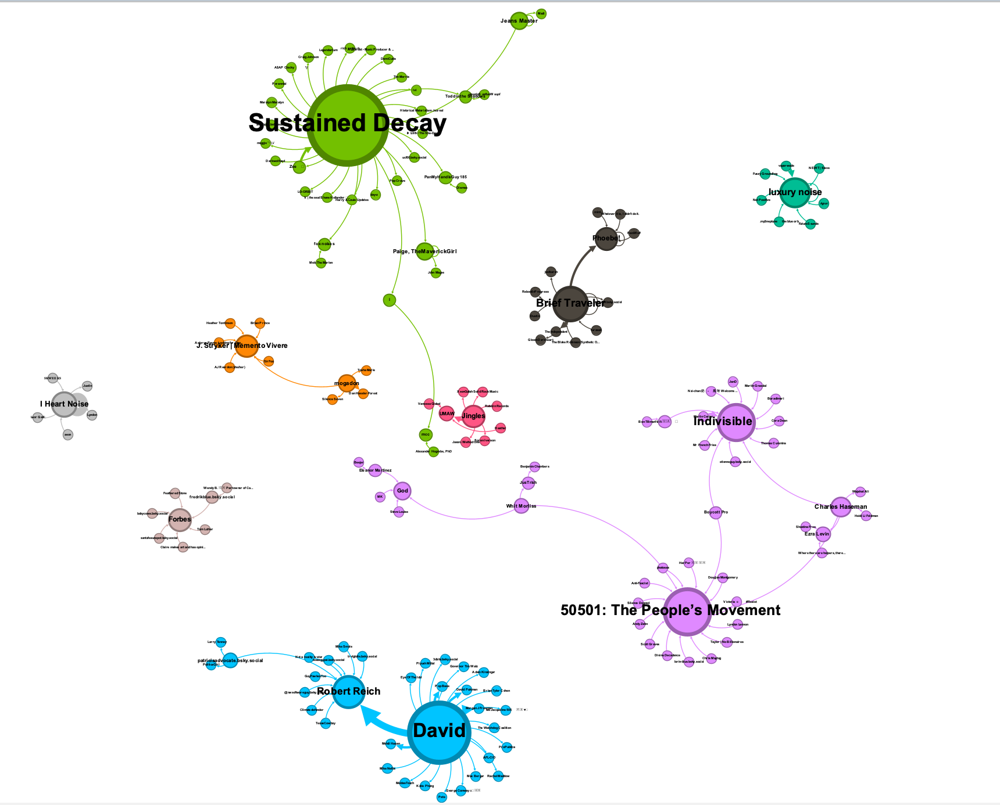
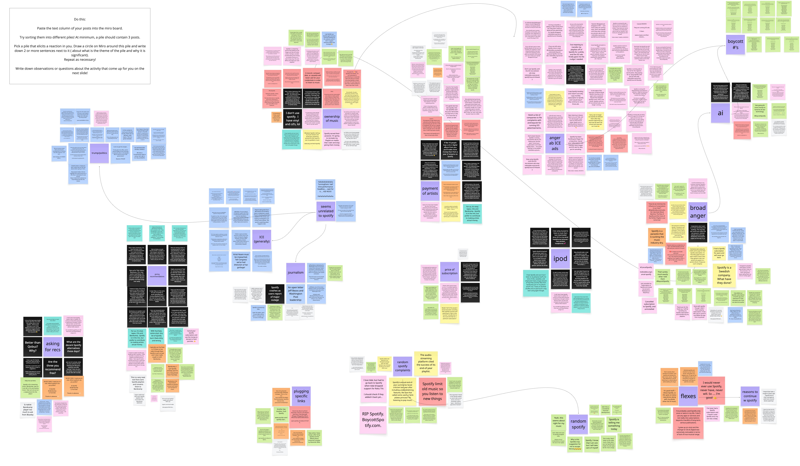

# Abstract

This project examines how Bluesky users discuss Spotify and how they
make sense of their relationship to music streaming platforms. While
initial data collection focused on Spotify's recurring price increases,
the analysis expanded to capture broader discourse around platform
value, ethics, identity, and alternative forms of music consumption.

Using a mixed-methods approach combining social network, sentiment, and
qualitative thematic analysis, I identified several key patterns in the
data. The network analysis revealed fragmented conversational clusters
with limited interaction across communities, and the sentiment analysis
reveals a growing trend of negativity in Spotify discourse. The
qualitative analysis identified key themes, including ethical framing in
relation to artist compensation, identity performance around non-use of
Spotify, and discussions of alternative listening practices such as
Bandcamp, vinyl, and music ownership. Overall, the findings suggest
Spotify discourse on Bluesky extends beyond pricing and reflects
tensions surrounding cultural consumption, platform capitalism, and user
identity. These critiques are often individualized and fragmented as
opposed to forming coordinated collective action.

# Analysis

To analyze Spotify-related discourse on Bluesky, I collected data using
the Bluesky Search API with queries such as "Spotify price increase,"
"Spotify AND Bandcamp," "Spotify AND vinyl," and "Spotify AND
ownership." These queries were designed to capture both direct
discussion of Spotify and surrounding conversations about alternative
music consumption practices. The final dataset contained approximately
11,894 posts from 7,176 unique users. After cleaning and deduplication,
the dataset was reduced to approximately 4,095 posts. I then constructed
a directed reply network using Gephi, where nodes represent users and
edges represent reply interactions. Node size was scaled by number of
replies received, and modularity was used to identify community
clusters.

<figure id="fig:my_label" data-latex-placement="h">

<figcaption>Network Graph on Gephi Charting Spotify
Discourse</figcaption>
</figure>

The network visualization shows a highly fragmented structure, with
multiple loosely connected clusters rather than a single unified
conversation. A small number of users act as attention hubs, receiving
disproportionately high engagement, while most users remain within
isolated conversational communities. This suggests that Spotify
discourse on Bluesky is not centralized but instead distributed across
multiple semi-independent discussion spaces. This network structure
helps reveal whether Spotify discourse forms a cohesive conversation or
remains fragmented across communities.

In addition to network analysis, I conducted sentiment analysis and
qualitative coding. Posts were manually categorized using a [Miro
board](https://miro.com/app/board/uXjVGmZGNaQ=/?share_link_id=827880733990).
I selected 420 posts that were representative of the dataset, drawing
from the top 70 posts from the top 6 clusters. These were sorted into
themes such as artist compensation, identity-based non-use, and platform
criticism.

<figure id="fig:my_label" data-latex-placement="h">

<figcaption>Miro Board Thematic Analysis</figcaption>
</figure>

For more about this project, see the attached [Colab
notebook](https://colab.research.google.com/drive/13MoymsApaz5DCJa6CuEsS2eKosvXNirX?usp=sharing),
detailing my process and insights.

# Key Findings

## Ethical Framing Through Artist Compensation

Going into this project, I knew the price increase would be a point of
contention for Spotify users. I initially believed this was primarily
for "selfish" reasons, as in frustration over an increase in spending.
However, thematic analysis led me to conclude that criticism is framed
less around personal inconvenience and more around ethical concerns
about artist compensation. In fact, the price increase often intensifies
the concern, as users question why they are being charged more despite
artists still being paid so little per stream. When considered alongside
the rising subscription costs, this comparison reinforces the perception
that Spotify is extractive rather than supportive of artists.

The general conversation seems to be shifting away from streaming as a
convenience and toward the ethics of participation. Bluesky discussion
around Spotify, even among active users, reflects an ongoing moral
negotiation about whether using the platform aligns with their values.
This represents a shift in how users conceptualize digital platforms.
Spotify is no longer seen as a neutral service for streaming, but rather
as an entity responsible for how value is distributed within the music
industry. The emphasis on per-stream payouts shows users engaging with
the infrastructure of the music industry beyond just the music they
consume.

## Identity Surrounding Non-Use

Another recurring theme is the way users frame their lack of Spotify
use, whether this be through never having the app or having abandoned
it, as a form of identity performance. Rather than offering alternatives
or engaging deeply with critiques, many posts emphasize personal
distance from the platform as a kind of "flex."

This theme is interesting because it shows how discourse can shift from
systemic critique to self-positioning. The focus moves away from
Spotify's practices and toward the individual's relationship to the
platform. Not using Spotify becomes less about solving a problem and
more about signaling taste, ethics, or independence from mainstream
platforms. This is significant because it can limit the conversation
from turning into a movement. While these posts may raise awareness in a
minimal sense, they often shut down dialogue rather than expanding it,
and lack practical solutions. By framing non-use as an obvious or easy
choice, they overlook the structural reasons why Spotify remains
dominant, including convenience, social integration, and discovery
features, and further alienate those stuck in the habit of usage.

# Conclusion

This project shows that Bluesky users discuss Spotify as more than a
streaming service, rather, as an ethical and cultural platform shaped by
concerns about artist compensation, personal identity, and alternative
consumption practices. While pricing concerns initiated the dataset,
conversations consistently extend beyond cost to broader questions about
fairness and user participation. However, these critiques are largely
fragmented across communities, as shown through network analysis. Rather
than forming a cohesive "boycott" movement, users tend to express
individual perspectives within isolated clusters. This suggests that
while awareness of platform issues is widespread, it does not easily
translate into collective action.

Spotify is engaged with as an ethical object, a cultural platform, and a
site of identity performance. Overall, this study highlights the
complexity of platform critique in contemporary digital culture and
raises further questions about how ethical awareness, identity, and
infrastructure interact in shaping user behavior.
